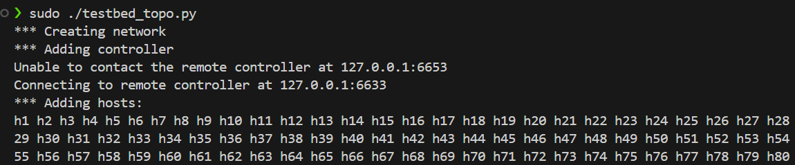
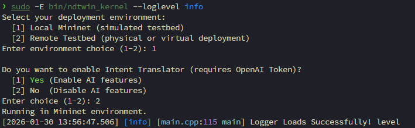

# Network Traffic Generator — User Manual


This guide explains how to use commands in our **Network Traffic Generator(NTG)** to generate traffic flows in intervals with specific parameters. For the installation, you can follow this [links](./installation_guide/README.md). In this manual, we demonstrate things as below :

- [NTG configuration](#network-traffic-generator-configuration)
- [Flow generation configuration](#flow-command-configuration)
- [Support commands in NTG](#support-commands-in-ntg)
- [How to use NTG in Mininet](#how-to-use-ntg-in-mininet)
- [How to use NTG in Hardware Testbed](#how-to-use-ntg-in-hardware)

## Files Overview


- `network_traffic_generator.py`: Interactive CLI that accepts commands.
- `network_traffic_generator_worker_node.py`: The worker node which receive flow generation requests from controller and manage iperf3 processes.
- `Utilis/`: Contains some related util functions.
- `setting/Hardware.yaml`: Nornir host inventory (testbed controller + worker nodes + on-site host IPs).
- `setting/API_server_startup.yaml`: Nornir group file (startup/shutdown commands for worker-node API servers).
- `setting/Mininet.yaml`: Mininet runtime mode and local ndtwin kernel (basic metadata).
- `NTG.yaml`: Nornir configuration pointing to the inventory files above.
- `flow_template.json` & `dist_template.json`: Example configuration for intervals and flow generation parameters.

## Network Traffic Generator Configuration
Ensure the following files exist and match your environment.

`NTG.yaml`
```yaml
inventory:
  plugin: SimpleInventory
  options:
    host_file: "./setting/Hardware.yaml"
    group_file: "./setting/API_server_startup.yaml"

runner:
  plugin: threaded
  options:
    num_workers: 5

logging:
  enabled: false
```
Notes:
- If you want to use `Mininet`, please change the path of `host_file` to `./setting/Mininet.yaml`

`setting/API_server_startup.yaml`
```yaml
worker_node_servers:
  data:
    startup_commands:
      - "source ~/ntg/bin/activate && cd Desktop/NTG && pwd && nohup uvicorn network_traffic_generator_worker_node:app --host 0.0.0.0 --port 8000 > uvi.log 2>&1 &"
    shutdown_commands:
      - "killall -9 uvicorn"
```
Notes:
- `startup_commands` should start your FastAPI server (e.g., `uvicorn network_traffic_generator_worker_node:app ...`) on each worker node.
- Adjust virtualenv path and ports as needed.

`setting/Hardware.yaml` (abbreviated; tailor to your hosts)
```yaml
Hardware_Testbed:
  hostname: "hardware_testbed"
  data:
    ndtwin_kernel: "http://10.10.xx.xx:8000"
    recycle_interval: 10
    sleep_time:
      min: 0.4
      max: 1.3
    ports_limitation:
      min_port: 5204
      max_port: 10204
      exclude_ports:
        - 8000
    log_level: "DEBUG"
    tcp_socket_write_length: "10K"  # in bytes, not including header, only payload, can use K for 1024 bytes, M for 1024*1024 bytes, etc.
    udp_packet_length: "1460"  # in bytes, not including header, only payload, can use K for 1024 bytes, M for 1024*1024 bytes, etc.

worker_node1:
  hostname: 10.10.xx.xx
  username: "server1"
  password: "xxooxx"
  port: 22
  groups:
    - worker_node_servers
  data:
    worker_node_server: "http://10.10.xx.xx:8000"
    retries: 5
    backoff_min_ms: 250.0
    backoff_max_ms: 500.0
    thread_count: 500
    on_site_hosts:
      h1: "192.168.yy.yy"
      # ... continue for h2–hzz

# Repeat similarly for worker_node2–worker_node4 with their ranges
```

Notes:
- `ndtwin_kernel` is the location of our NDTwin Kernel.
- `recycle_interval` is the interval for asking whether `worker_node_server` have finished some iperf3 and recycle the used ports.
- `sleep_time` defines the random waiting interval (in seconds) between starting iperf server and client to avoid "Connection Refused". `min` and `max` set the lower and upper bounds.
- `ports_limitation` controls the port range used for flow generation:
  - `min_port`: The minimum port number available for iperf flows.
  - `max_port`: The maximum port number available for iperf flows.
  - `exclude_ports`: A list of ports to exclude from the available range (e.g., ports used by other services like the API server).
- `log_level` sets the logging verbosity. Supported values: `TRACE`, `DEBUG`, `INFO`, `WARNING`, `ERROR`.
- `tcp_socket_write_length` sets the TCP socket write buffer length for each write operation (payload only, excluding headers).
- `udp_packet_length` sets the UDP packet payload length (excluding headers).
- `groups` must be a YAML list (e.g., `- worker_node_servers`).
- `data.worker_node_server` must be reachable from the machine running `network_traffic_generator.py`.
- `retries` specifies the number of retry attempts for worker nodes to restart iperf client.
- `backoff_min_ms` and `backoff_max_ms` define the minimum and maximum backoff time (in milliseconds) between retry attempts.
- `thread_count` sets the maximum number of concurrent threads for starting iperf client/server on each worker node.
- `data.on_site_hosts` maps logical host names (e.g., h1) to IP addresses. If you define lots of hosts in one worker node, please list all of them.
- Our NTG will distribute the role of client/server in iperf using the logical host names from the **NDTwin Kernel**. Thus, please make sure the logical host name is the same in **NDTwin Kernel** and **NTG**.

`setting/Mininet.yaml`

```yaml
Mininet_Testbed:
  hostname: "mininet_testbed"
  data:
    ndtwin_kernel: "http://127.0.0.1:8000"
    mode: "cli"
    log_level: "DEBUG"
    sleep_time:
      min: 0.4
      max: 1.3
    tcp_socket_write_length: "10K"  # in bytes, not including header, only payload, can use K for 1024 bytes, M for 1024*1024 bytes, etc.
    udp_packet_length: "1460"  # in bytes, not including header, only payload, can use K for 1024 bytes, M for 1024*1024 bytes, etc.
```

Notes:

- `mode` can be `cli` (Mininet's CLI) or `custom_command` (our generator's cli)
- **When using it, please make sure that Mininet is on you're machine.**

## Flow Generation Configuration

### `flow` Command Configuration

`flow_template.json` defines intervals and, for each interval, the flow mix and parameters. Key sections:

- `traffic_generator(iperf_or_iperf3)`: `iperf3` or `iperf` (tcp/udp supported)
- `intervals`: Array of interval objects. Each interval may include `varied_traffic` or `fixed_traffic` or both.

Common fields inside `varied_traffic`:

- `flow_arrival_rate(flow/sec)`: Average flow arrivals per second during the interval.
- `flow_distance_probability`: Probability distribution over `near/middle/far` path selection.
- `flow_type_probability`: Probability distribution over flow types (tcp/udp, limited/unlimited size/rate/duration).
- `flow_parameters`: Per-type parameter map defining `size(bytes)`, `rate(bits)`, and/or `duration(sec)` when applicable.

Common fields inside `fixed_traffic`:

- `fixed_flow_number`: Exact number of flows to generate in the interval.
- `flow_distance_probability`, `flow_type_probability`, `flow_parameters`: Same semantics as above.

Parameter format rules:

- `size(bytes)`: integer or suffixed with `K`, `M`, `G` (e.g., `10K`, `2M`)
  - Defining how many bytes you want to send.
- `rate(bits)`: integer or suffixed with `K`, `M`, `G` (e.g., `37.4M` allowed where implementation supports decimals)
  - Defining the sending rate of flows.
- `duration(sec)`: positive integer seconds. 
  - Defining how long will the flow keep alive.
- `packet_payload_size(bytes)`: integer or suffixed with `K`, `M`, `G` (e.g., `1024`, `2K`)
  - Defining the payload size of each packet (optional parameter for fine-tuning packet size).
  - Can be added to any flow type.
- Provide only the parameters that make sense for the chosen type:
  - limited size → requires `size(bytes)`
  - limited rate → requires `rate(bits)`
  - limited duration → requires `duration(sec)`
  - udp types include `-u` internally; tcp types do not.

Supported flow types for `varied_traffic`:

- `unlimited_size_unlimited_rate_unlimited_duration_tcp`
- `unlimited_size_unlimited_rate_limited_duration_tcp`
- `limited_size_unlimited_rate_tcp`
- `unlimited_size_limited_rate_unlimited_duration_tcp`
- `unlimited_size_limited_rate_limited_duration_tcp`
- `limited_size_limited_rate_tcp`
- `unlimited_size_unlimited_rate_unlimited_duration_udp`
- `unlimited_size_unlimited_rate_limited_duration_udp`
- `limited_size_unlimited_rate_udp`
- `unlimited_size_limited_rate_unlimited_duration_udp`
- `unlimited_size_limited_rate_limited_duration_udp`
- `limited_size_limited_rate_udp`

Supported flow types for `fixed_traffic` :

- `limited_size_unlimited_rate_tcp`
- `unlimited_size_limited_rate_limited_duration_tcp`
- `unlimited_size_limited_rate_unlimited_duration_tcp`
- `limited_size_limited_rate_tcp`
- `unlimited_size_limited_rate_unlimited_duration_udp`
- `unlimited_size_limited_rate_limited_duration_udp`
- `limited_size_limited_rate_udp`

Note: for each section (`varied_traffic` or `fixed_traffic`), the keys in `flow_type_probability` and `flow_parameters` must be chosen from the corresponding list above.

Example snippet (already present in `flow_template.json`):

```json
{
  "traffic_generator(iperf_or_iperf3)": "iperf3",
  "intervals": [
    {
      "interval_duration(d/h/m/s)": "3s",
      "varied_traffic": {
        "flow_arrival_rate(flow/sec)": 5,
        "flow_distance_probability": {"near": 0.0, "middle": 0.5, "far": 0.5},
        "flow_type_probability": {
          "limited_size_limited_rate_tcp": 0.1,
          "limited_size_unlimited_rate_udp": 0.9
        },
        "flow_parameters": {
          "limited_size_limited_rate_tcp": {"size(bytes)": "2M", "rate(bits)": "30M"},
          "limited_size_unlimited_rate_udp": {"size(bytes)": "4K"}
        }
      },
      "fixed_traffic":{
        "fixed_flow_number": 8,
        "flow_distance_probability": {"near": 0.0, "middle": 0.3, "far": 0.7},
        "flow_type_probability": {
          "limited_size_limited_rate_tcp": 0.2,
          "limited_size_unlimited_rate_udp": 0.8
        },
        "flow_parameters": {
          "limited_size_limited_rate_tcp": {"size(bytes)": "5K", "rate(bits)": "5M"},
          "limited_size_unlimited_rate_udp": {"size(bytes)": "4K"}
        }
      }
    }
  ]
}
```

#### Notice that the `limited_duration` in `fixed_traffic` will use `interval_duration(d/h/m/s)` as the default duration setting. If you would like to use the `interval_duration(d/h/m/s)` as the flow duration, then just make it empty as below

```json
{
    "interval_duration(d/h/m/s)": "10s",
    "fixed_traffic": {
        "fixed_flow_number": 20,
        "flow_distance_probability": {
            "near": 0.0,
            "middle": 0.5,
            "far": 0.5
        },
        "flow_type_probability": {
            "unlimited_size_limited_rate_limited_duration_tcp": 1.0
        },
        "flow_parameters": {
            "unlimited_size_limited_rate_limited_duration_tcp": {
                "rate(bits)": "37.4M"
            }
        }
    }
}
```

### `dist` Command Configuration

`dist_template.json` is the same as `flow_template.json` but the parameter of flows are come from distribution files.

The distribution file is the measured network flow properties from data centers or ISP. For using `dist` command, you need to generate 3 kinds of distribution files:

1. `distribution_flow_duration.csv` : the distribution of flow's life span.
2. `distribution_flow_sending_rate.csv` : the distribution of flow's sending rate
3. `distribution_flow_size.csv` : the distribution of flow's sent file size.

Each of the distribution files are used to replace the `duration(sec)`, `rate(bits)`, `size(bytes)` parameter of `flow_template.json`.

The distribution files is `csv` formate and the content likes below:

```csv
bin_midpoint,probability
1024,0.3
2048,0.5
4096,0.2
```

- `bin_midpoint`: The representative value for that bin (e.g., average flow size in bytes).
- `probability`: The probability of a flow having the characteristic of this bin. The sum of probabilities should be 1.0.

Example snippet (already present in `dist_template.json`):

```json
{
    "traffic_generator(iperf_or_iperf3)": "iperf3",
    "flow_size_csv": "./distribution_flow_size.csv",
    "flow_duration_csv": "./distribution_flow_duration.csv",
    "flow_sending_rate_csv": "./distribution_flow_sending_rate.csv",
    "intervals": [
        {
            "interval_duration(d/h/m/s)": "2s",
            "fixed_traffic": {
                "fixed_flow_number": 5,
                "flow_distance_probability": {
                    "near": 0.0,
                    "middle": 0.5,
                    "far": 0.5
                },
                "flow_type_probability": {
                    "unlimited_size_limited_rate_limited_duration_tcp": 1.0
                }
            }
        },
        {
            "interval_duration(d/h/m/s)": "3s",
            "varied_traffic": {
                "flow_arrival_rate(flow/sec)": 2,
                "flow_distance_probability": {
                    "near": 0.0,
                    "middle": 0.3,
                    "far": 0.7
                },
                "flow_type_probability": {
                    "unlimited_size_unlimited_rate_limited_duration_tcp": 0.3,
                    "limited_size_unlimited_rate_tcp": 0.3,
                    "unlimited_size_limited_rate_limited_duration_tcp": 0.4
                }
            }
        }
    ]
}
```

**Notice:** we do not support to setting `packet_payload_size(bytes)` parameter in any flow type when using `dist` command.

## Support Commands in NTG

### Commands

Our NTG support commands as below :

- `flow` : generate flows with defined parameters
- `dist` : flows' parameters come from distribution files.
- `exit` : exit the NTG.

**Notice that when using `flow` and `dist` command, you must add `--config flow_template.json` to specify which flow configuration files to use in one experiment.**

### How to Use

Our NTG support **path complete** and **syntax complete**. Thus, you can use `tab` and `arrow keys` to type the command.


If your'e configuration file and command are correct, NTG will start generate flows as below:

However, If you have syntax error or configuration file error, it will show some error words as below:


### Notice

- Our NTG do not support experiment interrupt. Thus, if you want to interrupt one running experiment, it will immediately shut down the NTG as below:
  


## How to use NTG in Mininet

### Pre-request

- You must have installed `Mininet`, `Ryu`, and `NDTwin`.
- You must have downloaded `NTG` and move those files and directories into folders with Mininet topology file written in `python`.
- You must make sure that the topology codes have been changed as [installation manual]()
- You must modify the `NTG.yaml`'s `host_file` into `./setting/Mininet.yaml ` and parameters in `./setting/Mininet.yaml`.

### Start Up Process

1. Start the Ryu Controller.

```bash
ryu-manager intelligent_router.py ryu.app.rest_topology ryu.app.ofctl_rest --ofp-tcp-listen-port 6633 --observe-link
```


2. Start the topology.

```bash
sudo python ./topo.py
```



3. Since NTG need some topology information from NDTwin, you need to wait for the Ryu Controller to install all flow rules into switches.


4. Start the NDTwin.

```bash
sudo -E bin/ndtwin_kernel --loglevel info
```


5. Now, you can start using NTG


## How to use NTG in Hardware

### Pre-request

- You must have installed `Ryu`, and `NDTwin`.
- You must have downloaded `NTG`.
- You must modify the `NTG.yaml`'s `host_file` into `./setting/Hardware.yaml ` and parameters in `./setting/Hardware.yaml`.

### Start Up Process

1. Start the Ryu Controller

```bash
ryu-manager intelligent_router.py ryu.app.rest_topology ryu.app.ofctl_rest --ofp-tcp-listen-port 6633 --observe-link
```

2. Start the NDTwin

```bash
sudo -E bin/ndtwin_kernel --loglevel info
```

3. Start the NTG

```bash
python network_traffic_generator.py
```

4. `Optional:` Manually Start worker node API servers on machines if the worker nodes do not start up correctly.

```bash
uvicorn network_traffic_generator_worker_node:app --host 0.0.0.0 --port 8000
```

5. Now, you can use `NTG` to generate flows.

## Tips

- Ensure all `data.worker_node_server` URLs in `Hardware.yaml` are reachable and the servers are running.
- Keep `flow_distance_probability` and `flow_type_probability` values normalized (sum to 1.0) for each section.
- Validate parameter names and formats in `flow_parameters` to match the selected types.
- For multiple consecutive experiments, the tool **resets internal state after completion**.
- For one experiment, it will be **ended only when all of flows, exclude flows with unlimited duration, are fininshed**.

## Troubleshooting

- If flows do not start: 
  - Confirm API servers are up, ports opened, and the `network_traffic_generator.py` process can reach them.
  - It may due to the CPU resources are not enough for you're flow configurations. Please lower the `flow numbers` or parameters to fix the question.
  - Since every iperf process will open **one file** and the **number of opening file may be limited**, the machine would be unable to run new iperf process when you have generated a huge amount of flows. Thus, you can change the `ulimits -n` or `ulimits -u` to a higher values to solve the problem.
- If Nornir inventory errors occur: double-check that `groups` is a YAML list and host keys/fields are correctly indented.
- If `uvicorn` fails to start: verify your virtualenv and ensure `uvicorn` is installed (`pip install uvicorn fastapi`).
